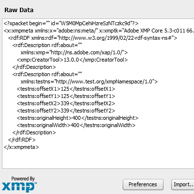

Photoshop-Export-Layers-to-Files-Fast - with custom XMP metadata
=================================

[upstream repo](https://github.com/jwa107/Photoshop-Export-Layers-to-Files-Fast/): 
><b>This script allows you to export layers in your Photoshop document as individual files</b> at a speed much faster than the built-in script from Adobe. 

Why did I make this fork:
-------------------------------
When composing and stacking images in photoshop for later application (eg. game engine), you may not always want to use sprite sheets. 
In order to use exported images as assets, the individual images can be labeled using metadata. XMP metadata can be used by backend or frontend scripts, and is supported in Adobe ExtendScript through an API. 

Example:
-------------------------------
When exporting layers that are free floating in a larger image or composition, you may want to trim (crop) each layer for optimization, and then be able to restore the composition in later application. The current master branch of this fork does that. After exporting image layers, the XMP metadata can be viewed from Adobe Bridge (by selecting exported image, then File -> File info..., and then switch to Raw data-tab): 
  
As you can see, there is a custom namespace called "testns" with tags "OffsetX1","OffsetY1", "originalHeight" and so on. Similarly, the xmp embedded in this screenshot iself actually has its correct offset dimensions and original screen resolution. 

How To Run the Script:
-------------------------------
1. Open Photoshop
2. Open image to export layers from
3. Run the script,

Alt A.
1. Open ExtendScript Toolkit. 
2. Select Photoshop CS6 as engine. 
3. Press the green run-icon.

Alt B.
* Double click on the jsx file to run

Alt C.
1. File -> Scripts -> Browse...
2. Locate the file, and open it.

Alt D. 
1. Move the script into the /presets/scripts directory, located by in your Photoshop folder.
Windows: /Program Files/Adobe/Adobe Photoshop VERSION/Presets/Scripts/
Mac: /Applications/Adobe Photoshop VERSION/Presets/Scripts/
2. Then run from File -> Scripts -> Photoshop Export Layers to Files (Fast) 

Requirements:
-------------------------------
* Adobe Photoshop CS6 
* Adobe Bridge CS6
* The ExtendScript Toolkit (ESTK) 3.5

Disclaimer: We are not associated with Adobe in any way. For any issues relating to Adobe products or Adobe scripts please contact them directly. We have never had an issue, but please use this script at your own risk. We are not responsible for any lost data or damaged PSDs so always make a back-up.
